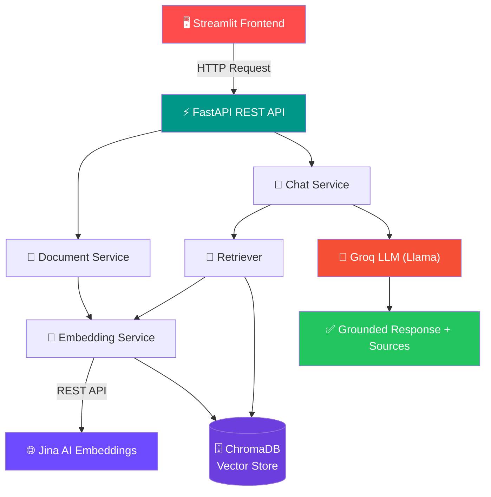

<div align="center">

# 📚 AI Document Intelligence Platform

### Production-Grade Retrieval-Augmented Generation (RAG) System

Upload your documents. Ask questions in plain English. Get grounded, hallucination-free answers — with sources.

[](https://www.python.org/)
[](https://fastapi.tiangolo.com/)
[](https://streamlit.io/)
[](https://www.trychroma.com/)
[](https://groq.com/)
[](#-license)

[](#)
[](#)
[](#)
[](#-contributing)

[Features](#-features) • [Architecture](#-architecture) • [Installation](#-installation) • [API Docs](#-api-documentation) • [Roadmap](#-roadmap) • [Contributing](#-contributing)

</div>

---

## 🧠 Overview

**AI Document Intelligence Platform** (also known as *Production RAG Chatbot* or *Enterprise Document Assistant*) is a modular, production-style **Retrieval-Augmented Generation** application. It lets users upload `PDF`, `TXT`, and `Markdown` documents and ask natural-language questions about their content.

Instead of relying on an LLM's internal (and often outdated or hallucinated) knowledge, the system retrieves the most relevant chunks of your documents using **semantic vector search** and generates a grounded response using **Groq-hosted LLMs** — citing exactly where the answer came from.

### 🎯 The Problem

| Limitation of Raw LLMs | How This Project Solves It |
|---|---|
| ❌ Cannot answer questions about private/internal documents | ✅ Retrieves content directly from your uploaded documents |
| ❌ May hallucinate or fabricate information | ✅ Answers are strictly grounded in retrieved context |
| ❌ No traceability of where an answer came from | ✅ Every response includes source document attribution |

---

## ✨ Features

| Category | Feature | Description |
|---|---|---|
| 📄 **Ingestion** | Multi-format Upload | Supports PDF, TXT, and Markdown files |
| 🔍 **Parsing** | PyMuPDF Extraction | Extracts text page-by-page with high fidelity |
| ✂️ **Chunking** | Intelligent Chunking | Splits large docs into optimal chunks for retrieval accuracy & lower embedding cost |
| 🧬 **Duplicate Detection** | Pre-index Check | Skips re-indexing documents already present in the vector store |
| 🧠 **Embeddings** | Jina AI (`jina-embeddings-v3`) | Converts text chunks into dense semantic vectors via REST API |
| 🗄️ **Vector Storage** | ChromaDB | Persists chunks, embeddings, and metadata (document name, page number) |
| 🎯 **Retrieval** | Semantic Search | Retrieves Top-K relevant chunks using vector similarity, not keywords |
| 🛡️ **Prompt Engineering** | Anti-Hallucination Prompting | Forces the LLM to answer only from context, or admit it doesn't know |
| 🤖 **LLM Inference** | Groq (Llama) | Ultra-fast grounded response generation |
| 💬 **Conversation Memory** | Chat History | Maintains context across multi-turn conversations |
| 📌 **Source Attribution** | Citations | Every answer lists the document(s) it was derived from |
| 📊 **Observability** | Structured Logging | Logs ingestion, retrieval, inference, and performance timings |

---

## 🏗️ Architecture

<details open>
<summary><strong>System Architecture Diagram</strong></summary>



</details>

<details>
<summary><strong>📥 Document Ingestion Pipeline</strong></summary>


</details>

<details>
<summary><strong>❓ Question Answering Pipeline</strong></summary>


</details>

---

## 🖼️ Screenshots

<div align="center">

| Chat Interface | Document Upload | Source Attribution |
|---|---|---|
|  |  |  |

*Replace the placeholders above with actual screenshots in `docs/screenshots/`.*

</div>

---

## 🧩 Tech Stack

<div align="center">

| Layer | Technology |
|---|---|
| **Language** | Python 3.10+ |
| **Backend** | FastAPI |
| **Frontend** | Streamlit |
| **Vector Database** | ChromaDB |
| **Embedding Model** | Jina Embeddings v3 (Jina AI API) |
| **LLM Provider** | Groq (Llama) |
| **PDF Parsing** | PyMuPDF |
| **HTTP Client** | Requests |
| **Config Management** | Pydantic Settings + python-dotenv |

</div>

---

## 📦 Installation

### Prerequisites

- Python **3.10+**
- A [Groq API key](https://console.groq.com/)
- A [Jina AI API key](https://jina.ai/embeddings/)

### 1️⃣ Clone the Repository

```bash
git clone https://github.com/your-org/ai-document-intelligence-platform.git
cd ai-document-intelligence-platform
```

### 2️⃣ Create a Virtual Environment

```bash
python -m venv venv
source venv/bin/activate      # On Windows: venv\Scripts\activate
```

### 3️⃣ Install Dependencies

```bash
pip install -r requirements.txt
```

<details>
<summary>📋 View core dependencies</summary>

```
fastapi
uvicorn
streamlit
chromadb
PyMuPDF
requests
python-dotenv
groq
langchain-text-splitters
pydantic
typing_extensions
```

</details>

### 4️⃣ Configure Environment Variables

Create a `.env` file in the project root:

```env
GROQ_API_KEY=your_groq_api_key_here
JINA_API_KEY=your_jina_api_key_here
CHROMA_DB_PATH=./chroma_db
DOCUMENTS_PATH=./documents
LOG_LEVEL=INFO
```

### 5️⃣ Run the Backend

```bash
cd backend
uvicorn app.main:app --reload --port 8000
```

### 6️⃣ Run the Frontend

```bash
cd frontend
streamlit run app.py
```

The app will be available at `http://localhost:8501`, with the API docs (Swagger) at `http://localhost:8000/docs`.

---

## 🔌 API Documentation

FastAPI automatically generates interactive **Swagger UI** docs at `/docs` and **ReDoc** at `/redoc`.

<details>
<summary><strong>📤 <code>POST /upload</code> — Upload a Document</strong></summary>

**Request:** `multipart/form-data`

| Field | Type | Description |
|---|---|---|
| `file` | File | PDF, TXT, or Markdown document |

**Response:**

```json
{
  "filename": "Microservices.pdf",
  "chunks_created": 42,
  "status": "success"
}
```

</details>

<details>
<summary><strong>💬 <code>POST /chat</code> — Ask a Question</strong></summary>

**Request:**

```json
{
  "question": "What are the benefits of microservices?"
}
```

**Response:**

```json
{
  "answer": "Microservices improve scalability and enable independent deployment...",
  "sources": ["Microservices.pdf"]
}
```

</details>

<details>
<summary><strong>❤️ <code>GET /health</code> — Health Check</strong></summary>

**Response:**

```json
{
  "status": "ok"
}
```

</details>

---

## 📁 Project Structure

```
ai-document-intelligence-platform/
├── backend/
│   └── app/
│       ├── api/
│       │   ├── routes.py          # API endpoint definitions
│       │   └── schemas.py         # Request/response models
│       ├── core/
│       │   ├── config.py          # App configuration (Pydantic Settings)
│       │   └── logger.py          # Logging setup
│       ├── embeddings/
│       │   └── embedder.py        # Jina AI embedding client
│       ├── ingestion/
│       │   ├── loader.py          # Document loading (PDF/TXT/MD)
│       │   ├── chunker.py         # Text chunking logic
│       │   └── schemas.py         # Ingestion data models
│       ├── llm/
│       │   └── groq_service.py    # Groq LLM inference client
│       ├── rag/
│       │   ├── retrieval.py       # Vector similarity retrieval
│       │   └── prompt.py          # Prompt engineering templates
│       ├── services/
│       │   ├── chat_service.py    # Chat orchestration logic
│       │   └── document_service.py # Document ingestion orchestration
│       ├── vectorstore/
│       │   └── chroma_store.py    # ChromaDB integration
│       └── main.py                # FastAPI app entrypoint
├── frontend/                      # Streamlit application
├── documents/                     # Uploaded document storage
├── chroma_db/                     # Persistent vector database
├── requirements.txt
└── README.md
```

---

## ⚙️ Configuration

| Variable | Description | Default |
|---|---|---|
| `GROQ_API_KEY` | API key for Groq LLM inference | — |
| `JINA_API_KEY` | API key for Jina AI embeddings | — |
| `CHROMA_DB_PATH` | Path to persistent ChromaDB storage | `./chroma_db` |
| `DOCUMENTS_PATH` | Local path for uploaded document storage | `./documents` |
| `LOG_LEVEL` | Logging verbosity | `INFO` |

---

## 🧱 Design Principles

- 🧩 **Modular Architecture** — clearly separated services for ingestion, embeddings, retrieval, and inference
- 🎯 **Separation of Concerns** — each module has a single, well-defined responsibility
- ♻️ **Reusable Services** — components can be swapped or extended independently
- 🛠️ **Config-Driven** — behavior controlled via environment variables and Pydantic settings
- 🧼 **Clean Code** — readable, maintainable, and consistently structured
- 🌐 **RESTful APIs** — predictable, well-documented endpoints

---

## 🚀 Advantages

✅ Grounded, hallucination-free responses
✅ Private document search — nothing leaves your control except embedding/inference calls
✅ Fast semantic retrieval via vector search
✅ Scalable, production-ready architecture
✅ Fully reusable service layer

---

## 🗺️ Roadmap

- [ ] 🔀 Hybrid Search (BM25 + Vector Search)
- [ ] 🗂️ Document filtering
- [ ] 📈 Reranking of retrieved chunks
- [ ] 🌊 Streaming responses
- [ ] 🔐 JWT Authentication
- [ ] 🐳 Docker support
- [ ] ⚡ Redis caching layer
- [ ] ☁️ Cloud deployment guide
- [ ] 👥 Multi-user support
- [ ] 📚 Multi-document collections
- [ ] 📌 Page-level citations
- [ ] 📊 Similarity score display
- [ ] 🛠️ Admin dashboard
- [ ] 🔤 OCR support
- [ ] 🖼️ Image understanding

---

## 🤝 Contributing

Contributions are welcome and greatly appreciated! 🎉

1. **Fork** the repository
2. **Create** a feature branch
   ```bash
   git checkout -b feature/amazing-feature
   ```
3. **Commit** your changes
   ```bash
   git commit -m "Add amazing feature"
   ```
4. **Push** to your branch
   ```bash
   git push origin feature/amazing-feature
   ```
5. **Open** a Pull Request

Please make sure to update tests and documentation as appropriate.

### 🐛 Found a Bug?

Open an [issue](../../issues) with a clear description, reproduction steps, and expected behavior.

---

## 📄 License

This project is licensed under the **MIT License** — see the [LICENSE](LICENSE) file for details.

---

<div align="center">

### ⭐ If you find this project useful, consider giving it a star!

Made with ❤️ using FastAPI, Streamlit, ChromaDB, Jina AI, and Groq

</div>
